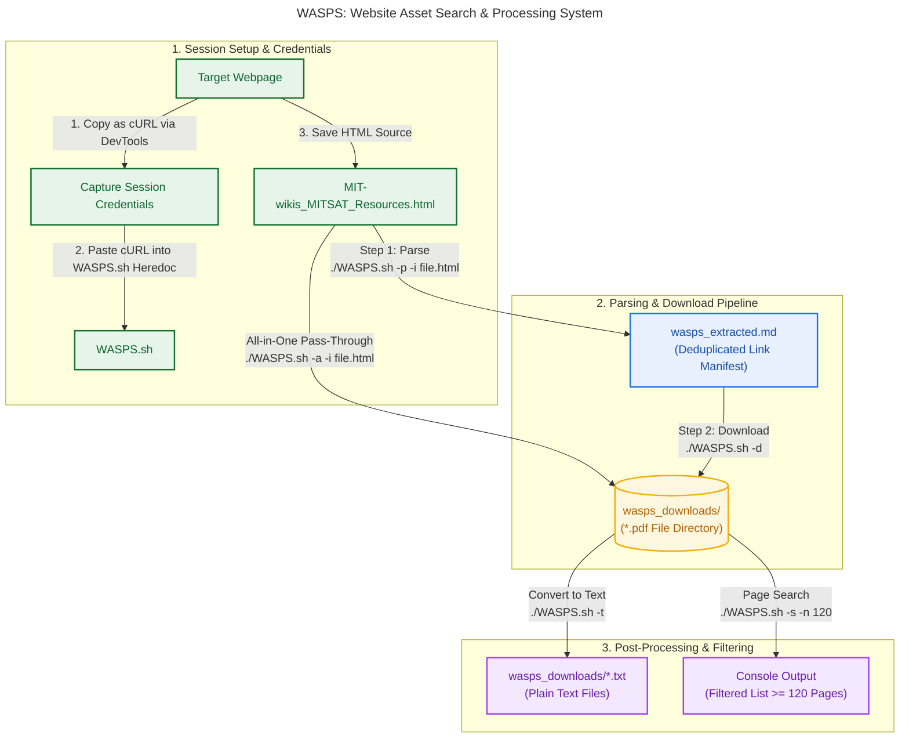

# WASPS Workflow Guide

This document outlines the standard end-to-end workflow for **WASPS (Website Asset Search & Processing System)**, using a real-world web page example.



---

## 1. Prerequisites & Installation

Ensure `poppler-utils` and `curl` are installed for PDF conversion, network retrieval, and page metadata extraction:

```bash
sudo apt update && sudo apt install -y poppler-utils curl
```

Make the script executable:

```bash
chmod +x WASPS.sh
```

---

## 2. Step-by-Step Workflow

### Step 1: Capture Browser Session Headers

To bypass authentication, SAML/SSO logins, or session restrictions:

1. Open your browser and navigate to the target site (e.g., `https://wikis.mit.edu/confluence/display/MITSAT/Resources`).
2. Open **Developer Tools** (`F12`) -> **Network** tab.
3. Click any document download link or refresh the page.
4. Right-click the network request -> **Copy** -> **Copy as cURL**.
5. Paste the copied cURL command directly into the `CHROME_CURL` Heredoc block inside `WASPS.sh`:

```bash
read -r -d '' CHROME_CURL << 'EOF'
curl '[https://wikis.mit.edu/confluence/display/MITSAT/Resources](https://wikis.mit.edu/confluence/display/MITSAT/Resources)' \
  -H 'accept: text/html,application/xhtml+xml...' \
  -b 'JSESSIONID=1234567890ABCDEF...' \
  -H 'user-agent: Mozilla/5.0...'
EOF
```

---

### Step 2: Save Target HTML Page

Save the webpage HTML containing your target asset links to your working directory:

* **Filename:** `MIT-wikis_MITSAT_Resources.html`

---

### Step 3: Parse HTML to Markdown (`-p`)

Extract clean, deduplicated document links into a Markdown manifest using the `-i` input flag. The parser strips web wrapper scripts (such as Confluence `preview.action` URLs) and normalizes filenames:

```bash
# Basic parsing with default output (wasps_extracted.md):
./WASPS.sh -p -i MIT-wikis_MITSAT_Resources.html

# Custom output markdown filename:
./WASPS.sh -p -i MIT-wikis_MITSAT_Resources.html -m wasps_extracted.md
```

**Output artifact:** `wasps_extracted.md` containing parsed items:

```markdown
# WASPS Extracted Documents (generic mode)
Generated on: Sun Oct 4 07:21:49 EDT 2026

* [falcon-users-guide-2025-05-09.pdf](https://wikis.mit.edu/confluence/download/attachments/329003366/falcon-users-guide-2025-05-09.pdf?api=v2)
* [Low_Earth_Orbit_Satellite_Design.pdf](https://wikis.mit.edu/confluence/download/attachments/329003366/Low%20Earth%20Orbit%20Satellite%20Design.pdf?api=v2)
* [nasa_systems_engineering_handbook_0.pdf](https://wikis.mit.edu/confluence/download/attachments/329003366/nasa_systems_engineering_handbook_0.pdf?api=v2)
```

---

### Step 4: Download Assets (`-d`)

Read the generated Markdown file and fetch all assets using your captured session credentials:

```bash
./WASPS.sh -d -m wasps_extracted.md -w wasps_downloads
```

*(Alternatively, run parsing and downloading in a single step using `-a`)*:

```bash
./WASPS.sh -a -i MIT-wikis_MITSAT_Resources.html -w wasps_downloads
```

---

### Step 5: Convert PDFs to Plain Text (`-t`)

Batch convert all downloaded PDFs inside the target directory into searchable `.txt` files:

```bash
./WASPS.sh -t -w wasps_downloads
```

* **Inputs:** `wasps_downloads/nasa_systems_engineering_handbook_0.pdf`
* **Outputs:** `wasps_downloads/nasa_systems_engineering_handbook_0.txt`

---

### Step 6: Search & Filter by Page Count (`-s`)

Filter downloaded PDF assets by minimum page threshold using `-n`:

```bash
./WASPS.sh -s -n 120 -w wasps_downloads
```

**Output example:**

```text
Searching for PDFs with >= 120 pages in: wasps_downloads...
Pages: 128      File: falcon-users-guide-2025-05-09.pdf
Pages: 320      File: Low_Earth_Orbit_Satellite_Design.pdf
Pages: 297      File: nasa_systems_engineering_handbook_0.pdf
Found 3 document(s) matching criteria.
```

---

## Quick Reference Summary

| Action | Command |
| --- | --- |
| **Parse HTML** | `./WASPS.sh -p -i MIT-wikis_MITSAT_Resources.html` |
| **Download Assets** | `./WASPS.sh -d -m wasps_extracted.md -w wasps_downloads` |
| **All-in-One (Parse + Download)** | `./WASPS.sh -a -i MIT-wikis_MITSAT_Resources.html` |
| **PDF to Text** | `./WASPS.sh -t -w wasps_downloads` |
| **Page Search (>= 120 pages)** | `./WASPS.sh -s -n 120 -w wasps_downloads` |